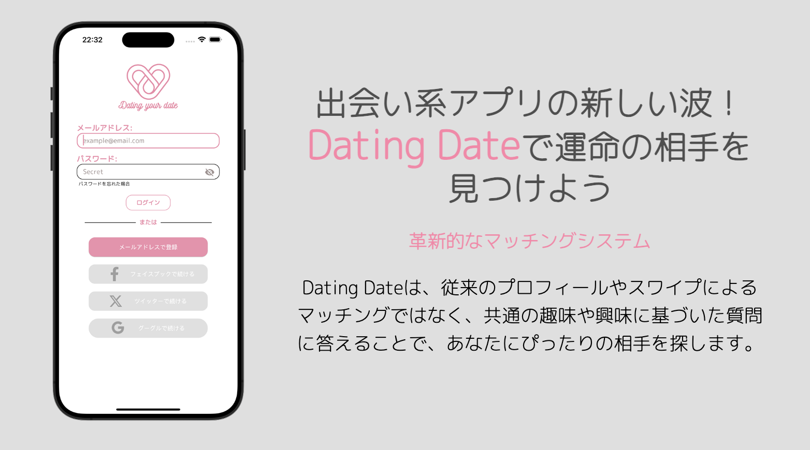

# 2年生個人開発ーマッチングアプリ


# 前期の準備
## スケジュール：


## フロントのデザイン：
<https://www.figma.com/community/file/1333658909585515894/dating-your-data>

# 実行流れ - バックエンド
# Mac
### インストール
* Docker をインストール
* Xcode をインストール
* homebrew をインストール
* Docker desktop をインストール
### 流れ
  #### コマンド :
  ###### migrate 
  > テーブル設定するソフトをインストール
  ```
  brew install golang-migrate
  ```
  ###### docker 設定
  > 不明の所があれば、Backendにmakefileをご覧て下さい
  ```
  make dockernetwork
  make postgres
  make setup_info
  make setup_chat
  make test
  ```
  ## server 起動
  ```
  make server
  ```

# Windows
### インストール
> window で実行すれば、ぜひビデオを見ながらやった方がいいと思います
* Youtubeに日本語字幕を自動翻訳できるビデオ　：　<https://www.youtube.com/watch?v=TtCfDXfSw_0>
* Windows なら　Sqlc　を無視！！
* vscode に　plugin ： go , Makefile Tools, WSL をインストール
  
### 流れ
> Vscode で　frontend と　backend 別々のウィンドウ のほうがいいと思います
* VscodeのターミナルはWSLのターミナルを変更
#### コマンド :
  ###### migrate 
  > テーブル設定するソフトをインストール
  ```
  curl -L https://packagecloud.io/golang-migrate/migrate/gpgkey | apt-key add -
  echo "deb https://packagecloud.io/golang-migrate/migrate/ubuntu/ $(lsb_release -sc) main" > /etc/apt/sources.list.d/migrate.list
  apt-get update
  apt-get install -y migrate
  ```
            
  ###### makefile 
  > カスタムコマンドのソフトをインストール
  ```
  sudo apt install make
  ```
       
  ###### docker 設定
  > 不明の所があれば、Backendにmakefileをご覧て下さい
  ```
  make dockernetwork
  make postgres
  make setup_info
  make setup_chat
  make test
  ```
  
## server 起動
```
make server
```

## フロントエンド
```
flutter pub get
flutter run
```
